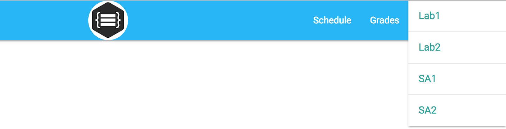
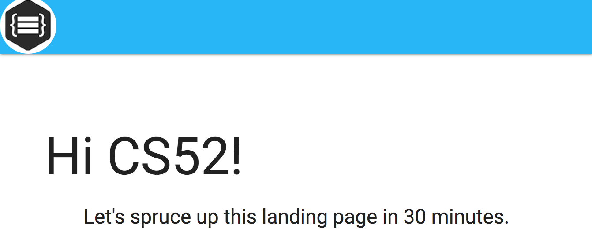
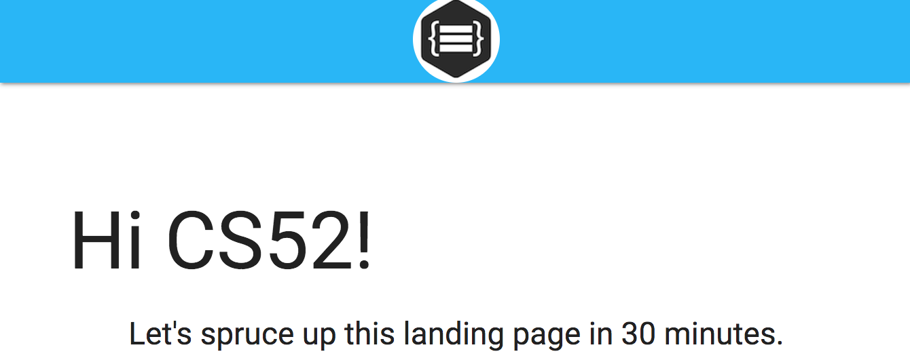

# Our mission :airplane:

Welcome! We're going to build a landing page, so basically what we did last week but better and we'll do it in only **30 minutes**. Thanks, Materialize!

We've given you an HTML file that's adapted from one of Materialize's starter template. You'll build a nice custom navbar with the help of the template code provided. We also have a nicely formatted section in the middle for you for some additional customizable content.

🚀 What do you need to add? Better title styles, images, and button effects! Plus, a modal and parallax.

Also, while we go through the tutorial, you might find it helpful to have `http://materializecss.com/` open so you can check out cool features, classes, and effects yourself. There's plenty of cool stuff that we won't cover that will make YOUR website much cooler.

## Basics

🚀 Add in some lines to the `head`:

```
  <link href="https://fonts.googleapis.com/icon?family=Material+Icons" rel="stylesheet">
  <link rel="stylesheet" href="https://cdnjs.cloudflare.com/ajax/libs/materialize/0.98.1/css/materialize.min.css">
```

And then add this line at the bottom of `body` right **AFTER** the jQuery script:
```
  <script src="https://cdnjs.cloudflare.com/ajax/libs/materialize/0.98.1/js/materialize.min.js"></script>
```

If it's not after the jQuery script, you'll get errors with the CDN script!


🚀 Let's make "Hi CS52" and the text under that stand out.

Find the "Hi CS52!" text. We want `h1` to include `class="header center orange-text"`.

Let's also change the text under that. Give `h5` some classes. Let's do `class="header col s12 light"`, or some other combination of classes. Up to you!


## Navigation bar

We are going to build a sweet navbar which you can customize. You'll have a custom Logo and a cool dropdown, demonstrated below:


The dropdown:



🚀 Now, to make the actual navbar, first locate the main `<div>` inside the `<nav>` tag and add the following class to it: `nav-wrapper`. This will apply a specific `materialize` style to the `<div>`. You can change the color by adding to the class: `light-blue`. You can cuztomize the colors in the `materialize.css`file. (What happens if you include: `lighten-3`?).

🚀 Grab an image from the internet and replace the text that says "LOGO" by adding a image source to the `` tag in `<a href="#">LOGO</img></a>`. If you want, you can use our logo in `img/logo.png` (hint: add a `src` field)

Once you have successfully replaced the LOGO text with an image, let's try to make the logo appear more pleasant by giving the logo image a circular frame. We can achieve this by adding a `circle` class to the `img` tag.

Your logo should now appear something like this:



Is your logo HUGE? The circle class doesn't have resizing in `Materialize`. We need to overwrite this, so go to the `css/style.css` file and add this in:

```
circle {
  height: 64px;
  width: auto;
}
```

Now your logo looks too crammed in the corner right? Let's center this logo at the top by adding to the `<a>` tag. The class `brand-logo` will center itself on medium and down the screens but you can also add `center` class if you want the logo to be always centered. 

Your logo should appear something like this:



🚀 Now, let's create the right menu items and dropdown by using an unordered list. In the `<ul>` tag add the class: `right hide-on-med-and-down` which will create a right oriented menu from the `li` tags. 

On the Assignments item, add `dropdown-button` to the `<a>` tag's class to indicate that it will be a dropdown button. Also add the attribute `data-activates="dropdown"`. This will identify the dropdown content defined below - the `dropdown` is like an `id`. Lastly, on the inner `<i>` tag set class to `material-icons right` to create the little arrow icon. You can experiment with this.

The navbar looks good, but there is no content defined for the dropdown. Let's fix that! 

For the `ul` tag (in the section after `</nav>`) set the id to `dropdown` to connect the dropdown button from the menu. Also set the class to `dropdown-content` to define the `ul` element as dropdown content. To create the horizontal dividers, you can transform `li` elements by setting their class to `divider`.

Finally add `$(".dropdown-button").dropdown({ hover: false });` to the `document.ready` function in the ```init.js``` file in the js folder. This will connect the dropdown with the dropdown content. Your navbar should be in good shape now!


## Stylize the icons

🚀 Add some style to the buttons!

For Button 1: replace `<button>Button 1</button>` with `<a class="btn">Button 1</a>`. This is a standard button. Notice it already looks good and has a cool hover effect.

Let's add a cool click effect. Instead of just `class="btn"`, make it `class="btn waves-effect waves-light"`. Click the button, it's so cool!

For Button 2, replace the old button with a round button. Do the same thing as Button 1, but instead of `btn`, use the class `btn-floating`. You can change the color by adding a class, like `cyan`. Let's try out Materialize's icon package too. Between `<a>` and `</a>`, add in `<i class="material-icons">add</i>`.

By the end of this, button 2 should look like:
```
<a class="btn-floating waves-effect waves-light cyan"><i class="material-icons">add</i></a>
```

For Button 3, replace the old button with `<a class="btn btn-floating pulse"><i class="material-icons">cloud</i></a>`. Check out the cool effect!

## Modal

🚀 Let's work on a modal. If you notice now, when you click on the modal button nothing happens. Let's fix that!

First, make sure you've replaced Button 3 with the anchor tag above.

Now let's set the target for the anchor. Add the ID of the modal to the href of the modal anchor, so it reads ```#getStartedModal```

Once that's done, we can start actually constructing the modal. Surround ```<h4>``` and ```<p>``` with a new div with the class name ```'modal-content'``` - this will tell Materialize where the content of the modal lives

Then, to add some buttons to the bottom, add a footer for the modal. Add a new div with the class ```'modal-footer'``` and then within the modal-footer div, add an anchor (```<a>```) with the href '#!' and the text 'I'm ready!'

Finally, add some classes to the anchor! You must add ```'modal-action'``` and ```'modal-close'``` for the button to work, but the others are up to you - some ideas are ```'waves-effect'``` and ```'btn-flat'``` - feel free to use some of the styling you learned above!

Now, when you click the modal button you'll notice it's not working yet... why not?!

As it turns out, Materialize makes you initialize their Javascript components. That's easy enough - in the ```init.js``` file, add this code below the drop down initializer:

```
  // code from:http://materializecss.com/modals.html#!
  // additional help from: http://stackoverflow.com/questions/41626343/materialized-modal-not-displaying
  // this initializes all modals so they can be triggered
  $('.modal').modal();
```

This will initialize all modals on the page and let them run.

## Parallax

🚀 Time to add parallax effects! With Materialize this is super easy.

To add parallax, all you have to do is add two parallax containers, one right after ```nav``` and before the ```section-white``` div, and the other right after the ```section-white``` div and before the ```footer```. That's it! Use the following parallax containers, in order:

```
  <!-- parallax code from: http://materializecss.com/parallax.html -->
  <div class="parallax-container">
    <div class='parallax'></div>
  </div>
```

```
  <!-- parallax code from: http://materializecss.com/parallax.html -->
  <div class="parallax-container">
    <div class='parallax'></div>
  </div>
```

It's not working!!! Why?! It's beacause we still have to initialize - add the following code right after your modal initialization in the ```init.js``` file:
```
  // parallax code from: http://materializecss.com/parallax.html
  $('.parallax').parallax();
```

## And You Are Done!

At this point, you should have a decent looking webpage that includes some really interesting features that would be difficult to implement from scratch. Here's a checklist for what you should have:
- [ ] added references to Materialize styling
- [ ] added logo to top of page
- [ ] nav bar drop-down section
- [ ] styled some buttons
- [ ] added a modal popover to the modal button
- [ ] added simple parallax sections

## Credits

Utilized extensively for tutorial code and for the base template: http://materializecss.com/

Photos from: https://unsplash.com
